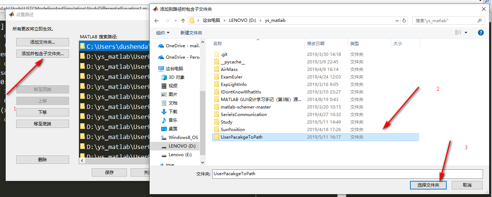

## MATLAB 增加自定义函数说明

众所周知，MATLAB 的函数调用是需要在同一个文件夹下面进行的，或者可以把函数添加到搜索路径。建议将常用的函数写好之后放到搜索路径，而一半的不添加搜索路径。当然还可以将文件作为一个程序包，可以不放在搜索路径，使用 `import`命令导入即可。下面分别说明。

## 1.添加路径

1. 写好函数放入文件夹

   

2. 选择文件夹添加路径

   先找到添加路径的地方<u>设置路径</u>。

   

   找到需要添加的文件夹。
   

   确认选择。

   

3. 一切应该都已经🆗了，检查一下

   ```matlab
   x=1:0.1:6*pi;
   x1=randi(10,1,length(x));
   x2=log(x);
   tabplot('1');plot(x,x1);plotset;
   tabplot('2');shade(x,x2);plotset;
   ```

   出来结果：

   

   

## 2.包的导入

待写...主要是文件夹命名问题。

## 